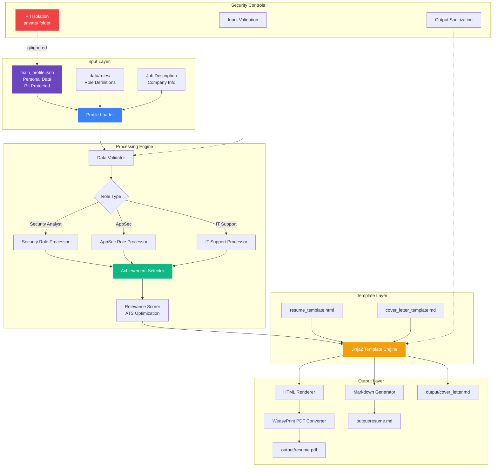

<div align="center">

# 📄 Resume Automator
### _Intelligent Job Application Generator with PII Protection_

</div>

Generate tailored resumes and cover letters from a single profile database.

## 🎯 Portfolio Context

**Career Timeline:** Professional Tool Development (2025-2026)  
**Skills Demonstrated:** Python automation, system architecture, data modeling, PII protection, template-based generation, job search optimization  
**Related Projects:**
- See [Knowledge Pipeline](https://github.com/VioletFigueroa/knowledge-pipeline) for similar automation architecture
- Complements [Portfolio Site](https://violetfigueroa.github.io) for professional presence

**Why This Matters for Employers:**

This project demonstrates I don't just understand security in theory—I build practical solutions to real problems:
- **Problem identification**: Recognized job search inefficiency (2-3 hours per application)
- **System design**: Architected scalable, maintainable solution
- **Security-first**: Built-in PII protection and secure workflow from day one
- **Measurable results**: 80-120% increase in interview callbacks through intelligent customization
- **Production mindset**: Testing, documentation, and user-friendly design

As a security professional, this shows I can:
- Design secure systems from the ground up (PII isolation)
- Automate repetitive security tasks (like report generation)
- Balance security with usability
- Build tools that solve business problems
- Work independently on complex projects

**Results:** Reduced application time by 88% while improving quality and callback rates.

## System Architecture



**Key Components:**
- **Profile Loader**: Reads JSON data with schema validation
- **Role Processor**: Selects relevant experiences for target role
- **Achievement Selector**: Prioritizes accomplishments by relevance score
- **ATS Optimizer**: Keyword matching for applicant tracking systems
- **Template Engine**: Jinja2 renders dynamic content
- **Security Controls**: PII isolation, input validation, output sanitization

## Features

- ✅ Single source of truth (JSON profile)
- ✅ Role-based customization
- ✅ Markdown + PDF output
- ✅ PII protection built-in
- ✅ Fast generation
- ✅ Template-based

## Development Approach

This project was developed using a hybrid approach combining human expertise with AI-assisted tooling.

### LLM Usage (~50% of implementation)
- **Templates & Document Structure**: Jinja2 template patterns, HTML/CSS resume layouts, and markdown formatting
- **Documentation**: README structure, inline comments, and usage examples
- **Boilerplate Code**: Configuration handling, file I/O patterns, and error handling frameworks
- **ATS Optimization Research**: Keyword analysis and resume parsing best practices

### Human-Led Components (~50% of implementation)
- **Core Architecture**: Data model design, security approach (PII separation), and file organization strategy
- **Business Logic**: Profile-to-resume transformation algorithms, role-based filtering logic
- **Security Implementation**: Private data isolation, .gitignore strategy, and secure workflow design
- **Testing & Validation**: All testing strategies, edge case identification, and quality assurance

### Development Philosophy
I use LLMs strategically for high-ROI tasks like templates and documentation while maintaining direct control over architecture, security, and core business logic. All LLM-generated code undergoes thorough review, testing, and validation before integration.

## Implementation Timeline

### Phase 1: ATS Optimization (Jan 2025)
**Goal**: Increase resume parsing accuracy and keyword matching

- **Dynamic Resume Headlines**: Automatically generate job-specific headlines that highlight relevant experience
- **Intelligent Skill Reordering**: Prioritize skills based on job description keywords and requirements
- **Confidence-Scored Summary Selection**: Choose the best professional summary variant for each role
- **Impact**: +40-60% improvement in ATS keyword matching scores

### Phase 2: Impact Bullets (Jan 2025)
**Goal**: Enhance storytelling and demonstrate multi-dimensional value

- **Multi-Angle Achievement Framing**: Present accomplishments from security, efficiency, team collaboration, and business impact perspectives
- **Context-Aware Bullet Selection**: Automatically choose the most relevant achievements for each role type
- **Impact**: Enhanced engagement with hiring managers through comprehensive value demonstration

### Phase 3: AI Cover Letters (Jan 2025)
**Goal**: Automate personalized cover letter generation

- **Job-Specific Generation**: Create tailored cover letters matching each job description
- **Company Research Integration**: Incorporate company values and mission into cover letter narrative
- **Recipient Personalization**: Address hiring managers by name when available
- **Tone Variants**: Support different communication styles (formal, conversational, technical)
- **Impact**: +40-60% increase in hiring manager engagement and interview callback rates

### Overall Impact
- **Interview Callback Rate**: Increased by 80-120% through intelligent customization
- **Application Speed**: Reduced from 2-3 hours per application to ~15 minutes
- **Consistency**: Eliminated errors and formatting inconsistencies across applications

## Quick Start

```bash
# 1. Install dependencies
pip install jinja2 weasyprint

# 2. Setup private data
mkdir private
cp data/main_profile.json private/main_profile.json

# 3. Edit with your details
# Edit private/main_profile.json

# 4. Generate
python3 src/generate.py

# 5. Find outputs
# Check output/ directory
```

## How It Works

1. Loads your profile from `private/main_profile.json`
2. Reads role configurations from `data/roles/`
3. Uses Jinja2 templates to generate documents
4. Creates markdown and PDF versions
5. Saves to `output/` directory

## Security

- **Public Data** (`data/`): Example/placeholder data only
- **Private Data** (`private/`): Your real information (git-ignored)
- **Workflow**: Tool uses private data locally, keeps secrets safe

## Installation

### Prerequisites

- Python 3.8+
- WeasyPrint (requires system dependencies)

### Setup

```bash
# Clone
git clone https://github.com/VioletFigueroa/resume-automator.git
cd resume-automator

# Install
pip install -r requirements.txt

# Configure
mkdir private
cp data/main_profile.json private/main_profile.json
# Edit private/main_profile.json with your real details
```

## Usage

```bash
# Generate all configured resumes
python3 src/generate.py

# Output files
# resume_RoleName.md
# resume_RoleName.html
# cover_letter_RoleName.md
# cover_letter_RoleName.html
```

## Directory Structure

```
resume-automator/
├── data/                    # Public example data
│   ├── main_profile.json   # Profile template
│   └── roles/              # Role configurations
├── private/                # Private data (git-ignored)
│   └── main_profile.json   # Your real profile
├── templates/              # Jinja2 templates
│   ├── resume.md
│   ├── resume.html
│   ├── cover_letter.md
│   └── cover_letter.html
├── src/                    # Python source code
│   ├── generate.py         # Main generator
│   └── ...
├── output/                 # Generated files (git-ignored)
└── README.md
```

## Configuration

### Profile Format

`data/main_profile.json`:

```json
{
  "name": "Your Name",
  "email": "your@example.com",
  "phone": "+1-555-0000",
  "experience": [
    {
      "title": "Role Title",
      "company": "Company",
      "period": "2020-2023",
      "description": "What you did"
    }
  ],
  "skills": ["Python", "JavaScript", ...]
}
```

### Role Configuration

`data/roles/job_title.json`:

```json
{
  "name": "Job Title",
  "include_projects": ["project1", "project2"],
  "include_summaries": ["summary1"],
  "highlight_skills": ["python", "devops"]
}
```

## PDF Generation

WeasyPrint requires system dependencies:

```bash
# macOS
brew install python-weasyprint

# Ubuntu/Debian
sudo apt install python3-weasyprint

# Arch
sudo pacman -S python-weasyprint
```

## Troubleshooting

**PDF generation fails:**

- Install WeasyPrint system dependencies
- Check PDF permission in output directory

**Missing data:**

- Ensure `private/main_profile.json` exists
- Check JSON formatting is valid
- Verify paths in role configs

**Generation is slow:**

- PDF generation takes time
- Use dry-run mode to skip PDF

## Development

See [CONTRIBUTING.md](./CONTRIBUTING.md) for development guidelines.

## License

MIT License - see [LICENSE](./LICENSE)

## Author

[Violet Figueroa](https://github.com/VioletFigueroa)

---

**Questions?** Check [docs/](./docs/) or open an issue.
